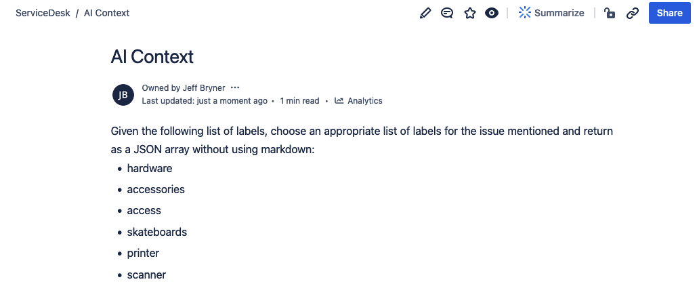
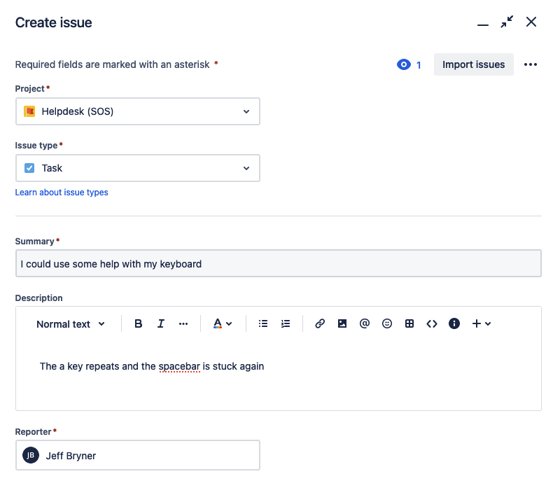
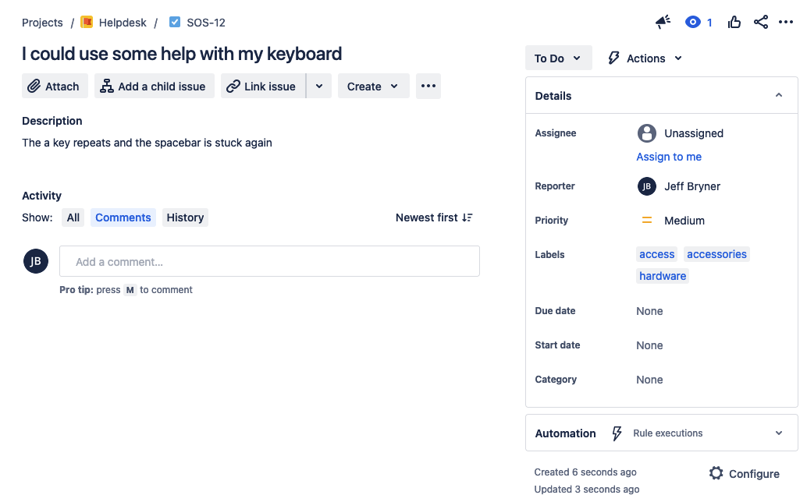

# gcp-ai-atlassian
Sample project using a cloud run container to perform AI helper tasks using Atlassian products (JIRA/Confluence) and Vertex AI.

Based on this starter kickstarter project : https://github.com/jeffbryner/gcp-cloudrun-python-pipeline, it includes a CICD pipeline and a container. The CICD pipeline uses cloud build and some triggers to build the container. 

The container is a proof of concept using vertex AI to perform a simple AI task in JIRA using a prompt context from a confluence page. This allows you to fine tune the behavior of the AI prompt without having the alter the code. 

Simple containers like this can be useful to perform more complex tasks than can be managed in the JIRA/Confluence native workflows, in this case introducing vertex AI. We attach the container to JIRA via a simple JIRA webhook for issue creation giving it the URL of the cloud run container. (It'll be provided as terraform output, something like https://ai-atlassian-randomchars.run.app/jira-webhook )

This one adds labels mentioned in a confluence page to any new issue created in JIRA

Here's the confluence page as context for the AI: 

If we create a new issue:  

A JIRA webhook calls the cloud run container and asks AI to add some helpful labels to the issue for us: 

This is meant as a POC, but there are lots of other uses for this pattern
- Categorize JIRA issues
- Update components
- Include a summary of the description provided by AI
- Assign tickets based on skills listed in a confluence page
- Set the priority of the ticket based on some guidance
- Provide suggested KB articles to the reporter or the one assigned to the ticket
- etc. 

## Setup
You will need to be able to create a project with billing in the appropriate place in your particular org structure. First you'll run terraform locallly to initialize the project and the pipeline. After the project is created, we will transfer terraform state to the cloud bucket and from then on you can use git commits to trigger terraform changes without any local resources or permissions.

For more detail, see the instructions in  https://github.com/jeffbryner/gcp-cloudrun-python-pipeline

